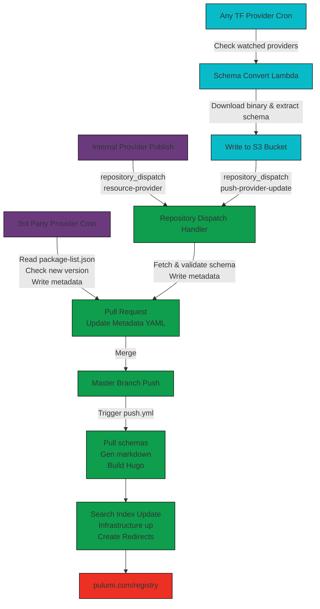

# Architecture

Definitions:

- **Registry Repo**: Metadata, templates, scripts & workflow. Builds pulumi.com/registry
- **Registry API**: Part of pulumi-service. AKA "Private Registry"

## Information Flow Diagram

## Registry Package Updates

There are currently three sources of information for updating the registry:

1. Internal Providers (Pulumi repos)
2. TF Providers (OpenTofu registry)
3. 3rd Party Providers (other GitHub orgs)

### Internal Provider

When a provider is published, the provider's CI job dispatches a GitHub Actions `repository_dispatch` event of the type `resource-provider` to the `pulumi/registry` repository (see [Repository Dispatch Handling](#repository-dispatch-handling)). Here's an example of [AWS dispatching the `resource-provider` event type](https://github.com/pulumi/pulumi-aws/blob/ac9d16db7c9bbf56ff8a2e0c2746693b7309c2e1/.github/workflows/publish.yml#L240-L251). See [Repository Dispatch Handling](#repository-dispatch-handling) for what happens to this event.

### TF Provider

For dynamically bridged providers–where we don't maintain a dedicated repository for the bridging source and releases–we need to poll for changes and build the schema so we can generate Pulumi registry docs. This runs twice per day.

1. Source provider list is read from an S3 object (pushed from the `watched-providers` config value in the [Pulumi.yaml](https://github.com/pulumi/terraform-to-pulumi-registry-pipeline/blob/main/Pulumi.yaml))
2. If there's a new version available, we download the binary in a sandbox lambda and push the schema to an S3 bucket.
3. Send a `repository_dispatch` event to `pulumi/registry` of type `push-provider-update` with URLs to where the files are available in the bucket (see [Repository Dispatch Handling](#repository-dispatch-handling)).

See [terraform-to-pulumi-registry-pipeline](https://github.com/pulumi/terraform-to-pulumi-registry-pipeline) (internal) for more detail on the lambda-based pipeline.

### 3rd Party

For provider which are published by third parties via GitHub repositories (as Pulumi providers rather than TF providers), we use a [scheduled GitHub Actions workflow](https://github.com/pulumi/registry/blob/master/.github/workflows/generate-package-metadata.yml) to check for updates to publish. This is run twice a day.

1. Read the list of third-party providers from [community-packages/package-list.json](https://github.com/pulumi/registry/blob/master/community-packages/package-list.json).
2. For each, check if the latest published version is newer than the version recorded in the metadata file [themes/default/data/registry/packages/[PROVIDER].yaml](https://github.com/pulumi/registry/tree/master/themes/default/data/registry/packages).
3. If there's a new version, download the schema from the repository, validate it and open a pull request to update the metadata file.

### Repository Dispatch Handling

The [publish-provider-update](https://github.com/pulumi/registry/blob/master/.github/workflows/publish-provider-update.yml) workflow supports 2 types of events:

1. `resource-provider(PROVIDER_SHORT_NAME, PROVIDER_VERSION, PROVIDER_SCHEMA_PATH?)` (see [Internal Provider](#internal-provider))
2. `push-provider-update(PROVIDER_SHORT_NAME, PROVIDER_SCHEMA_URL, PROVIDER_INDEX_URL)` (see [TF Provider](#tf-provider))

When one of these events is received, we fetch the schema, validate it, then open a pull request to update the relevant metadata file: [themes/default/data/registry/packages/[PROVIDER].yaml](https://github.com/pulumi/registry/tree/master/themes/default/data/registry/packages).

## Pull requests

When a pull request is opened by the above processes we auto-merge the PR if all checks pass (validation & site build).

## Publish

When the master branch is updated, we build and publish the whole registry static site (see [.github/workflows/push.yml](https://github.com/pulumi/registry/blob/master/.github/workflows/push.yml))

1. Build the hugo site (`make ci_push` --> [`scripts/ci/push.sh`](https://github.com/pulumi/registry/blob/master/scripts/ci/push.sh)):
   1. [`scripts/ci/build.sh`](https://github.com/pulumi/registry/blob/master/scripts/ci/build.sh) runs `resourcedocsgen docs registry ...` which downloads all schemas from their sources and generates markdown files.
   2. Hugo builds the static site.
2. Push the built site to a new S3 bucket (see [scripts/ci/sync.sh](https://github.com/pulumi/registry/blob/master/scripts/ci/sync.sh)) and update an SSM parameter keyed by the commit hash.
3. Update the search indexes (see [scripts/generate-search-index.sh](https://github.com/pulumi/registry/blob/master/scripts/generate-search-index.sh)).
4. Run the Pulumi infrastructure deployment.
5. Create [S3 redirects](https://github.com/pulumi/registry/blob/master/scripts/ci/make-s3-redirects.sh).
