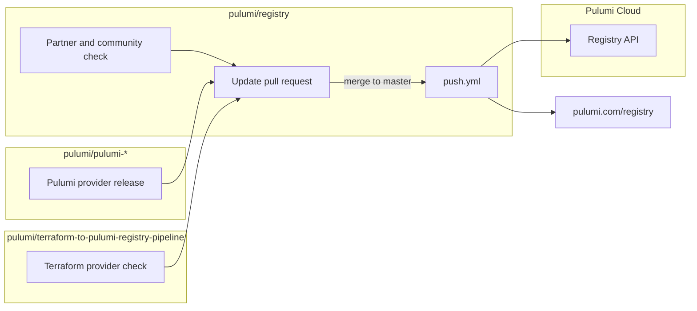
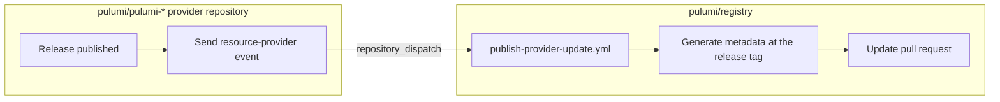
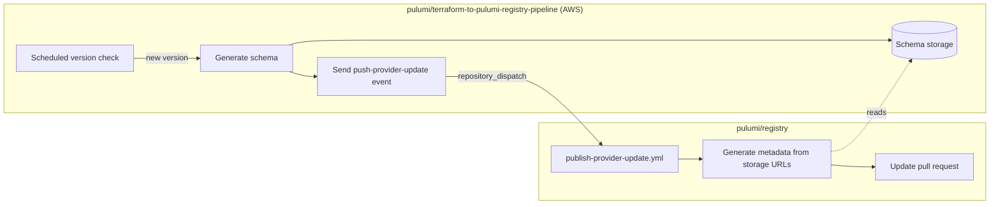
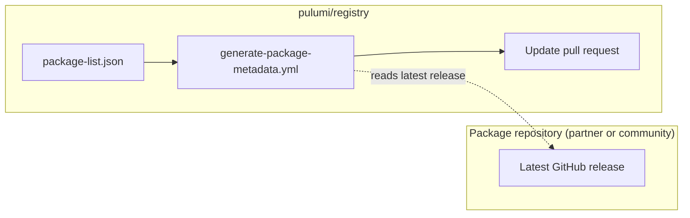
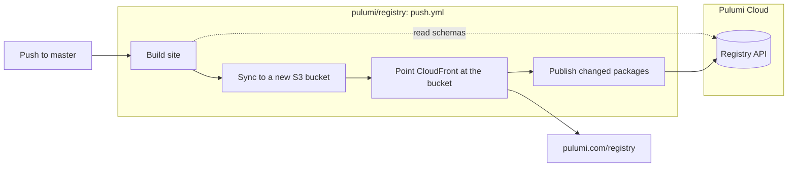

# Registry architecture

This repository keeps two things current with every package release:

- **The registry site** at [pulumi.com/registry](https://www.pulumi.com/registry), a static Hugo site built from this repository and hosted on AWS.
- **The Registry API**, the Pulumi Cloud service behind `pulumi package add`. The site build reads package schemas from it, and each production deploy publishes new package versions to it.

Every package is described by a metadata file, `themes/default/data/registry/packages/<package>.yaml`, which records its version, schema URL, publisher, and display details. A new version reaches neither destination until a pull request updates that file and merges to `master`. So every release follows the same shape: something notices the new version and opens a pull request, the pull request merges once its checks pass, and the merge rebuilds the site and publishes the package.

```mermaid
flowchart LR
    accTitle: How a new package version reaches the registry
    accDescr: A Pulumi provider release, the Terraform provider pipeline, or the partner and community check opens an update pull request in pulumi/registry. When it merges, push.yml rebuilds pulumi.com/registry and publishes to the Registry API.

    subgraph providers ["pulumi/pulumi-*"]
        release["Pulumi provider release"]
    end

    subgraph tfpipeline ["pulumi/terraform-to-pulumi-registry-pipeline"]
        pipeline["Terraform provider check"]
    end

    subgraph registry ["pulumi/registry"]
        community["Partner and community check"]
        pr["Update pull request"]
        push["push.yml"]
        community --> pr
        pr -->|merge to master| push
    end

    subgraph cloud ["Pulumi Cloud"]
        api["Registry API"]
    end

    release --> pr
    pipeline --> pr
    push --> site["pulumi.com/registry"]
    push --> api
```

## Registry package updates

A new package version enters the registry through one of three paths, depending on where the package comes from. All three end the same way, with an [update pull request](#update-pull-requests) against the package's metadata file.

| Path | Covers | Triggered by | Runs in |
|---|---|---|---|
| [Pulumi providers](#pulumi-providers) | Providers in `pulumi/pulumi-<name>` repositories | The provider's release workflow | The provider repository, then `pulumi/registry` |
| [Terraform providers](#terraform-providers) | Dynamically bridged Terraform providers | A recurring schedule | `pulumi/terraform-to-pulumi-registry-pipeline`, then `pulumi/registry` |
| [Partner and community packages](#partner-and-community-packages) | Packages listed in `community-packages/package-list.json` | A recurring schedule | `pulumi/registry` |

### Pulumi providers

```mermaid
flowchart LR
    accTitle: Pulumi provider update path
    accDescr: A release in a pulumi/pulumi-* provider repository sends a resource-provider event to pulumi/registry, where publish-provider-update.yml generates metadata from the release tag and opens an update pull request.

    subgraph provider ["pulumi/pulumi-* provider repository"]
        release["Release published"] --> send["Send resource-provider event"]
    end

    subgraph registry ["pulumi/registry"]
        handler["publish-provider-update.yml"] --> metadata["Generate metadata at the release tag"]
        metadata --> pr["Update pull request"]
    end

    send -->|repository_dispatch| handler
```

Pulumi's own providers tell the registry about a release as it happens. When a provider publishes a release, its release workflow sends a `repository_dispatch` event of type `resource-provider` to this repository. Most provider repositories get this step from a [`pulumi/ci-mgmt`](https://github.com/pulumi/ci-mgmt) template. The `base` template, used by bridged providers, sends the event with a GitHub Action in [`publish.yml`](https://github.com/pulumi/ci-mgmt/blob/a385cbd207ddc170b47fa79e340d13bb5414e3bc/provider-ci/internal/pkg/templates/base/.github/workflows/publish.yml#L234-L267). The `native` template, used by native providers and some components, sends it with `pulumictl create docs-build` in [`release.yml`](https://github.com/pulumi/ci-mgmt/blob/a385cbd207ddc170b47fa79e340d13bb5414e3bc/provider-ci/internal/pkg/templates/native/.github/workflows/release.yml#L676-L707). A few repositories with hand-written release workflows, such as `pulumi/pulumi-azure-native`, call `pulumictl create docs-build` directly.

The event's `client_payload` carries:

- `project-shortname`: the package name, such as `aws`.
- `ref`: the release tag, such as `v7.2.0`.
- `schema-path` (optional): the schema's path in the provider repository, when it isn't the default `provider/cmd/pulumi-resource-<name>/schema.json`.

[`publish-provider-update.yml`](../.github/workflows/publish-provider-update.yml) handles the event by running `resourcedocsgen metadata from-github` against `pulumi/pulumi-<project-shortname>` at that tag, with Pulumi as the publisher. The command reads the schema, checks its name, version, category, and publisher, and writes the metadata file. It also copies the provider's `docs/_index.md` into this repository as the package's Overview page, along with `docs/installation-configuration.md` when the provider has one. The workflow then opens an [update pull request](#update-pull-requests).

Because the repository is derived from `project-shortname`, this path only works for providers that live at `pulumi/pulumi-<name>`. A Pulumi-maintained package that doesn't match that pattern can be listed in `package-list.json` instead, which puts it on the [partner and community path](#partner-and-community-packages).

### Terraform providers

Dynamically bridged Terraform providers, the ones you use with `pulumi package add terraform-provider <name>`, have no provider repository of their own and no release workflow to notify the registry. A pipeline in AWS watches for their releases instead. It's defined in [`pulumi/terraform-to-pulumi-registry-pipeline`](https://github.com/pulumi/terraform-to-pulumi-registry-pipeline), which is internal, so links into it only work for members of the Pulumi GitHub organization.

```mermaid
flowchart LR
    accTitle: Terraform provider update path
    accDescr: On a schedule, the pipeline in pulumi/terraform-to-pulumi-registry-pipeline checks watched providers for new versions, generates each new schema into S3, and sends a push-provider-update event. publish-provider-update.yml in pulumi/registry reads the schema from storage and opens an update pull request.

    subgraph pipeline ["pulumi/terraform-to-pulumi-registry-pipeline (AWS)"]
        check["Scheduled version check"] -->|new version| generate["Generate schema"]
        generate --> storage[("Schema storage")]
        generate --> send["Send push-provider-update event"]
    end

    subgraph registry ["pulumi/registry"]
        handler["publish-provider-update.yml"] --> metadata["Generate metadata from storage URLs"]
        metadata --> pr["Update pull request"]
    end

    send -->|repository_dispatch| handler
    metadata -.->|reads| storage
```

On a recurring schedule, the pipeline checks each provider in the `watched-providers` list in its [`Pulumi.yaml`](https://github.com/pulumi/terraform-to-pulumi-registry-pipeline/blob/main/Pulumi.yaml). Only providers on that list are covered, not every Terraform provider. For each one, it compares the latest stable version in the provider's registry, such as the OpenTofu registry, with the version pulumi.com/registry has. When there's a new version, a Lambda function runs `pulumi package get-schema` on the provider, stores the schema and an Overview page in an S3 bucket behind a CDN, and sends a `repository_dispatch` event of type `push-provider-update` to this repository. The pipeline reports its own failures as GitHub issues.

The event's `client_payload` carries:

- `project-shortname`: the package name.
- `schema-url`: the schema's URL in the pipeline's storage.
- `index-url`: the Overview page's URL in the same storage.

The version isn't part of the payload. [`publish-provider-update.yml`](../.github/workflows/publish-provider-update.yml) downloads the schema, reads the version from it, and checks that the schema's publisher is listed in [`publisher-names.json`](../tools/resourcedocsgen/pkg/publishers/publisher-names.json). It then runs `resourcedocsgen metadata from-urls`, which applies the same schema checks as the Pulumi providers path and writes a metadata file that points at those URLs, so they have to stay available after the pull request merges. The workflow then opens an [update pull request](#update-pull-requests).

### Partner and community packages

```mermaid
flowchart LR
    accTitle: Partner and community package update path
    accDescr: generate-package-metadata.yml in pulumi/registry reads package-list.json, compares each package repository's latest GitHub release with the registry, generates metadata from the repository at that tag, and opens an update pull request.

    subgraph registry ["pulumi/registry"]
        list["package-list.json"] --> check["generate-package-metadata.yml"]
        check --> pr["Update pull request"]
    end

    subgraph upstream ["Package repository (partner or community)"]
        release["Latest GitHub release"]
    end

    check -.->|reads latest release| release
```

Packages that don't notify the registry themselves are picked up by checking their GitHub releases. Most are maintained by Pulumi partners and community members, including the [Pulumiverse](https://github.com/pulumiverse) organization, and a few Pulumi-maintained components are listed the same way. Each has an entry in [`community-packages/package-list.json`](../community-packages/package-list.json), and adding one is how a package joins the registry. See [Adding a new package](./adding-a-new-package.md) for that process.

[`generate-package-metadata.yml`](../.github/workflows/generate-package-metadata.yml) runs on a recurring schedule (the cron is in the workflow file) and on demand. It also runs whenever a merge to `master` changes `package-list.json`, so a newly added package doesn't wait for the next scheduled run. For each entry, the workflow:

1. Skips the package if an update pull request for it is already open.
1. Compares the tag of the repository's latest GitHub release with `version` in the package's metadata file.
1. When they differ, runs `resourcedocsgen metadata from-github` against the repository at that tag, which reads the schema and docs the same way the [Pulumi providers](#pulumi-providers) path does, and opens an [update pull request](#update-pull-requests).

## Update pull requests

All three paths open their pull requests with the same composite action, [`.github/actions/new-provider-version-pr`](../.github/actions/new-provider-version-pr/action.yml). Each pull request is authored by `pulumi-bot` on a branch named `<package>/publish-metadata`, so a package has at most one open update pull request at a time.

The action turns on squash auto-merge when it creates the pull request, and [`auto-approve-for-auto-merge.yml`](../.github/workflows/auto-approve-for-auto-merge.yml) approves pull requests from `pulumi-bot`. The pull request then merges on its own once the `Sentinel` status passes. [`pull-request.yml`](../.github/workflows/pull-request.yml) reports that status only after every required job succeeds, including linting, the Go and infrastructure tests, a full preview build of the site, and a check that every package's metadata can be turned into a Registry API publish request. An update that would break the build stays open for a maintainer to look at.

If either update workflow fails, it posts to the `#registry-ops` Slack channel. For the full list of pull request checks, see [`pull-request.yml` in BUILD-AND-DEPLOY.md](../BUILD-AND-DEPLOY.md#51-pull-requestyml--pr-validation--preview-deploy).

## Publish

Every push to `master`, whether it's an update pull request or any other change, runs [`push.yml`](../.github/workflows/push.yml). It rebuilds and deploys the whole site, then publishes changed packages to the Registry API.

```mermaid
flowchart LR
    accTitle: Publish on push to master
    accDescr: push.yml builds the site while reading schemas from the Registry API, syncs it to a new S3 bucket, points CloudFront at that bucket to update pulumi.com/registry, then publishes changed packages to the Registry API.

    merge["Push to master"] --> build

    subgraph registry ["pulumi/registry: push.yml"]
        build["Build site"] --> sync["Sync to a new S3 bucket"]
        sync --> swap["Point CloudFront at the bucket"]
        swap --> publish["Publish changed packages"]
    end

    subgraph cloud ["Pulumi Cloud"]
        api[("Registry API")]
    end

    build -.->|read schemas| api
    publish --> api
    swap --> site["pulumi.com/registry"]
```

The workflow runs these steps in order:

1. [`scripts/ci/build.sh`](../scripts/ci/build.sh) generates API docs for every package with `resourcedocsgen docs registry`, restoring packages that haven't changed from cache, and then builds the site with Hugo. Each schema is read from the Registry API, falling back to the `schema_file_url` in the metadata file when the API doesn't have that version yet. That fallback is how a version merged moments ago gets built before it's published.
1. [`scripts/ci/sync.sh`](../scripts/ci/sync.sh) uploads the built site and its LLM-friendly docs bundles to a new S3 bucket for this commit, runs browser smoke tests against it, and records the bucket in `origin-bucket-metadata.json`. The search index is uploaded to the same bucket.
1. `pulumi up` on the [`infrastructure/`](../infrastructure) program reads `origin-bucket-metadata.json` and points the CloudFront origin at the new bucket, so the live site switches to the new build in one step. The workflow then invalidates cached registry pages on the pulumi.com CDN and creates the S3 redirects.
1. [`scripts/ci/publish_to_registry.py`](../scripts/ci/publish_to_registry.py) publishes each package whose metadata file changed in the push to the Registry API.

For every step, its environment, and the AWS resources involved, see [`push.yml`](../BUILD-AND-DEPLOY.md#52-pushyml--production-build--deploy), [Deployment infrastructure](../BUILD-AND-DEPLOY.md#deployment-infrastructure), and [Registry publication](../BUILD-AND-DEPLOY.md#registry-publication) in BUILD-AND-DEPLOY.md.

## Learn more

- [Adding a new package](./adding-a-new-package.md) — how a partner or community package gets listed, and what maintainers check before merging.
- [Previewing your package's docs](./previewing-package-docs.md) — how to see a release's pages before its update pull request merges.
- [Previewing registry changes](./previewing-registry-changes.md) — how to build and preview a change to this repository.
- [BUILD-AND-DEPLOY.md](../BUILD-AND-DEPLOY.md) — the full reference for the build, every workflow, and the deployment infrastructure.
