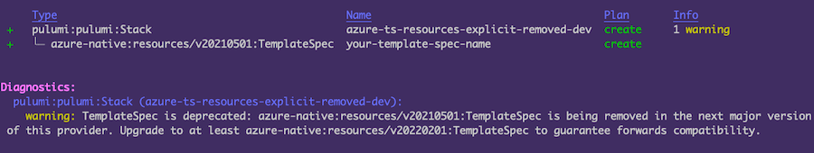
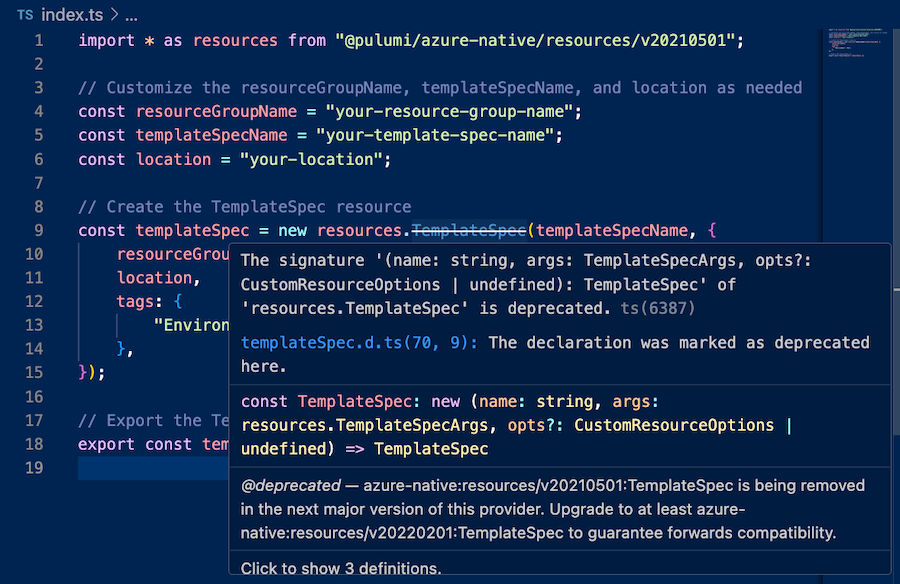

## About

The Pulumi Azure Native Provider v3 is now available. 
To upgrade to v3, there are a few changes you may need to make depending on your Pulumi programs.

## Upgrade Steps

### Prerequisites

We recommend upgrading to the [latest version](https://github.com/pulumi/pulumi-azure-native/releases/tag/v2.82.0) of the v2 provider as a prerequisite to the v3 upgrade. This will enable you to resolve any pre-existing deprecated versions or resource structure changes.  If you're
still using v1, you must first upgrade to v2 before upgrading to v3; see the [v1 to v2 upgrade guide](../../azure-native-v2/from-v1-to-v2/).

Review your program for warnings on missing imports or deprecated resources. If your program contains any deprecated explicit versions, you will need to update these to a newer version. The suggested version is shown in the deprecation message.





### Upgrade Dependencies

In your Pulumi program, upgrade the package to point to the latest v3.x version.

* JavaScript/TypeScript: [`@pulumi/azure-native`](https://www.npmjs.com/package/@pulumi/azure-native/v/3.0.0)
* Python: [`pulumi-azure-native`](https://pypi.org/project/pulumi-azure-native/3.0.0/)
* Go: [`github.com/pulumi/pulumi-azure-native/sdk/go/azure`](https://github.com/pulumi/pulumi-azure-native/releases/tag/v3.0.0)
* .NET: [`Pulumi.AzureNative`](https://www.nuget.org/packages/Pulumi.AzureNative/3.0.0)
* Java: [`com.pulumi.azurenative`](https://central.sonatype.com/artifact/com.pulumi/azure-native/3.0.0)



{}

```
-"@pulumi/azure-native": "^2.0.0",
- "resolved": "https://registry.npmjs.org/@pulumi/azure-native/-/azure-native-2.82.0.tgz",
- "resolved": "https://registry.npmjs.org/@pulumi/azure-native/-/azure-native-2.82.0.tgz",
+ @pulumi/azure-native": "v3.0.0",
+ "resolved": "https://registry.npmjs.org/@pulumi/azure-native/-/azure-native-3.0.0.tgz",
+ "resolved": "https://registry.npmjs.org/@pulumi/azure-native/-/azure-native-3.0.0.tgz",
```

{}
{}

```python
- pulumi_azure_native==v2.82.0
+ pulumi_azure_native==v3.0.0
```

{}
{}

```csharp
- <PackageReference Include="Pulumi.AzureNative" Version="2.82.0"
+ <PackageReference Include="Pulumi.AzureNative" Version="3.0.0"
```

{}
{}

```go
- github.com/pulumi/pulumi-azure-native-sdk/v2/storage v2.82.0
+ github.com/pulumi/pulumi-azure-native-sdk/v3/storage v3.0.0
```

{}

{}

### Upgrade Imports

Go programs will need all imports updated to include `v3` in the path.

```go
import (
- "github.com/pulumi/pulumi-azure-native-sdk/resources/v2"
- "github.com/pulumi/pulumi-azure-native-sdk/storage/v2"
+ "github.com/pulumi/pulumi-azure-native-sdk/resources/v3"
+ "github.com/pulumi/pulumi-azure-native-sdk/storage/v3"
)
```

If you do not replace the deprecated import, you can expect to see an error message:

```bash
    error: Running program '<path/to/project>' failed with an unhandled exception:
Error: Cannot find module '@pulumi/azure-native/resources/v20210501'
```

### Review Pulumi Diff

After updating all imports to reflect v3 included Azure API versions, run `pulumi preview` and review the output.

#### Pending Changes on Default Versions

You may see pending changes when using the default version as the shape of the resource may have changed. You can choose to accept the changes, update your program to modify the resource properties to mitigate changes, or choose an explicit version which is compatible with the older version of the resource.

A full list of default version changes can be found in the [top-level resource versions](./top-level-resource-versions).

To continue using the previous Azure API version of a resource:

1. Check the documentation in your IDE or our [registry API docs](https://www.pulumi.com/registry/packages/azure-native/) which identifies the previous version for each resource. For example: `Azure REST API Version: 2022-06-15. Prior API version in Azure Native 1.x: 2020-06-01`
2. Import the previous version of the resource. These are available in the version-specific sub-folders of the SDK.

Below are examples of changing an import to use an explicit version in each language.



{}

```typescript
- import { EventSubscription } from "@pulumi/azure-native/eventgrid";
+ import { EventSubscription } from "@pulumi/azure-native/eventgrid/v20200601";
```

{}
{}

```python
- from pulumi_azure_native import eventgrid
+ from pulumi_azure_native.eventgrid import v20200601 as eventgrid
```

{}
{}

```csharp
- using EventGrid = Pulumi.AzureNative.EventGrid;
+ using EventGrid = Pulumi.AzureNative.EventGrid.V20200601;
```

{}
{}

```go
- import eventgrid "github.com/pulumi/pulumi-azure-native-sdk/eventgrid/v3"
+ import eventgrid "github.com/pulumi/pulumi-azure-native-sdk/eventgrid/v3/v20200601”
```

{}
{}

```yaml
- type: azure-native:eventgrid:Topic
+ type: azure-native:eventgrid/v20200601:Topic
```

{}


### Contributing

If you experience any unexpected issues during your migration or would like to contribute to our codebase, please visit our [respository](https://github.com/pulumi/pulumi-azure-native) to open an [issue](https://github.com/pulumi/pulumi-azure-native/issues) or submit a pull request.
